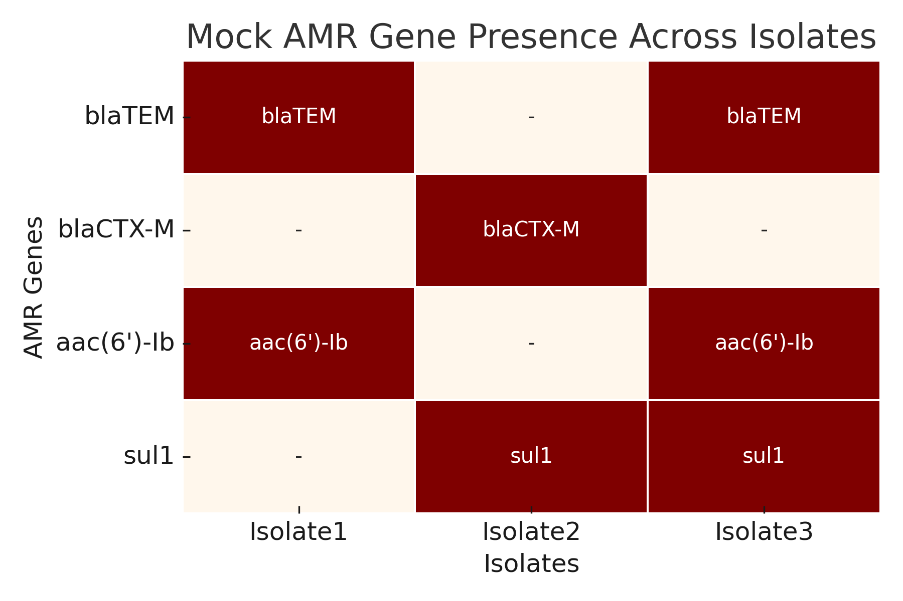

#  AMRFinderPlus Analysis

This folder contains antimicrobial resistance (AMR) gene detection outputs and visualization code to detect and compare AMR genes across multiple *P. mirabilis* isolates using the latest version of NCBI AMRFinderPlus.

## Tool
- [AMRFinderPlus](https://github.com/ncbi/amr)
- Database version: 2024-05

```bash
# Make sure you have the latest AMRFinderPlus and database
conda install -c bioconda ncbi-amrfinderplus

# Download or update database
amrfinder_update

# Run for each isolate
amrfinder -n isolate01_contigs.fasta -o isolate01_amr.tsv --organism Proteus_mirabilis
amrfinder -n isolate02_contigs.fasta -o isolate02_amr.tsv --organism Proteus_mirabilis
```

## Files
| File                    | Description                     |
|-------------------------|---------------------------------|
| `run_amrfinder.sh`      | Shell command to run AMRFinder  |
| `amrfinder_summary.csv` | Parsed gene × sample matrix     |
| `plot_amr_heatmap.py`   | Python code for heatmap         |

## Output Example


